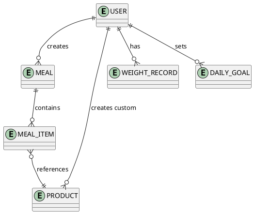

# Концептуальная модель

## Основные сущности

- `User`
- `Meal`
- `MealItem`
- `Product`
- `WeightRecord`
- `DailyGoal`

## Связи

- один пользователь владеет многими приемами пищи
- один прием пищи состоит из многих `MealItem`
- `MealItem` ссылается на `Product`, но хранит снапшот БЖУ и названия
- пользователь имеет множество записей веса
- пользователь имеет дневные цели по КБЖУ

## ER-диаграмма

## Почему MealItem хранит снапшот

Если продукт в справочнике изменится, история пользователя не должна пересчитываться задним числом. Поэтому в `MealItem` фиксируются:

- `productName`
- `calories`
- `protein`
- `fat`
- `carbs`
- `quantity`
