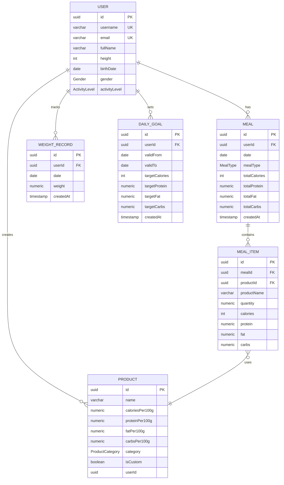

# Логическая и физическая модели

## Логическая модель

### User

- `id`
- `username`
- `email`
- `fullName`
- `birthDate`
- `gender`
- `height`
- `activityLevel`

### Meal

- `id`
- `userId`
- `date`
- `mealType`
- `totalCalories`
- `totalProtein`
- `totalFat`
- `totalCarbs`
- `createdAt`

### MealItem

- `id`
- `mealId`
- `productId`
- `productName`
- `quantity`
- `calories`
- `protein`
- `fat`
- `carbs`

### Product

- `id`
- `name`
- `caloriesPer100g`
- `proteinPer100g`
- `fatPer100g`
- `carbsPer100g`
- `category`
- `isCustom`
- `userId`

### WeightRecord

- `id`
- `userId`
- `weight`
- `createdAt`

### DailyGoal

- `userId`
- `date`
- `targetCalories`
- `targetProtein`
- `targetFat`
- `targetCarbs`

## Физическая модель

Рекомендуемые типы:

- `uuid` для первичных ключей
- `numeric(8,2)` для значений БЖУ и веса
- `integer` для калорий
- `timestamp` для технических дат
- `date` для календарных записей и целей

## Индексация

- `user.email` - unique index
- `meal(user_id, date)` - для дневника питания
- `daily_goal(user_id, date)` - для целей
- `weight_record(user_id, created_at)` - для диапазонных запросов
- `product.name` - полнотекстовый индекс в Elasticsearch


## Логическая модель


    
## Физическая модель
```sql
Enum Gender {
  MALE
  FEMALE
}

Enum ActivityLevel {
  LOW
  MODERATE
  ACTIVE
  VERY_ACTIVE
}

Enum MealType {
  BREAKFAST
  LUNCH
  DINNER
  SNACK
}

Enum ProductCategory {
  MEAT
  POULTRY
  FISH
  DAIRY
  EGGS
  GRAINS
  LEGUMES
  VEGETABLES
  FRUITS
  NUTS
  OILS
  OTHER
}

Table user {
  id uuid [pk, default: `gen_random_uuid()`]
  username varchar(100) [unique]
  email varchar(255) [unique, not null]
  fullName varchar(200)
  height smallint
  birthDate date
  gender Gender
  activityLevel ActivityLevel
  createdAt timestamp [default: `now()`]
}

Table product {
  id uuid [pk, default: `gen_random_uuid()`]
  name varchar(255) [not null]
  caloriesPer100g numeric(8,2) [not null]
  proteinPer100g numeric(8,2)
  fatPer100g numeric(8,2)
  carbsPer100g numeric(8,2)
  category ProductCategory
  isCustom boolean [not null, default: false]
  userId uuid [null]

  indexes {
    name
    userId
    category
  }
}

Table meal {
  id uuid [pk, default: `gen_random_uuid()`]
  userId uuid [not null]
  date date [not null]
  mealType MealType [not null]
  totalCalories integer [default: 0]
  totalProtein numeric(8,2) [default: 0]
  totalFat numeric(8,2) [default: 0]
  totalCarbs numeric(8,2) [default: 0]
  createdAt timestamp [default: `now()`]

  indexes {
    userId
    (userId, date)
  }
}

Table mealItem {
  id uuid [pk, default: `gen_random_uuid()`]
  mealId uuid [not null]
  productId uuid [not null]
  productName varchar(255) [not null]
  quantity numeric(8,2) [not null]
  calories integer
  protein numeric(8,2)
  fat numeric(8,2)
  carbs numeric(8,2)

  indexes {
    mealId
    productId
  }
}

Table weightRecord {
  id uuid [pk, default: `gen_random_uuid()`]
  userId uuid [not null]
  date date [not null]
  weight numeric(6,2) [not null]
  createdAt timestamp [default: `now()`]

  indexes {
    userId
    (userId, date)
  }
}

Table dailyGoal {
  id uuid [pk, default: `gen_random_uuid()`]
  userId uuid [not null]
  validFrom date [not null]
  validTo date [null]
  targetCalories integer [not null]
  targetProtein numeric(8,2) [not null]
  targetFat numeric(8,2) [not null]
  targetCarbs numeric(8,2) [not null]
  createdAt timestamp [default: `now()`]

  indexes {
    userId
    (userId, validFrom)
  }
}

Ref: meal.userId > user.id
Ref: mealItem.mealId > meal.id
Ref: mealItem.productId > product.id
Ref: weightRecord.userId > user.id
Ref: dailyGoal.userId > user.id
Ref: product.userId > user.id
```