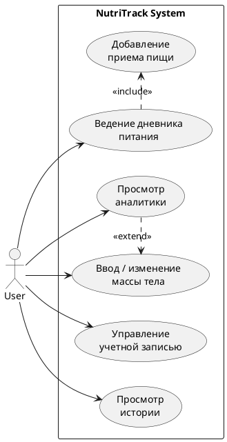
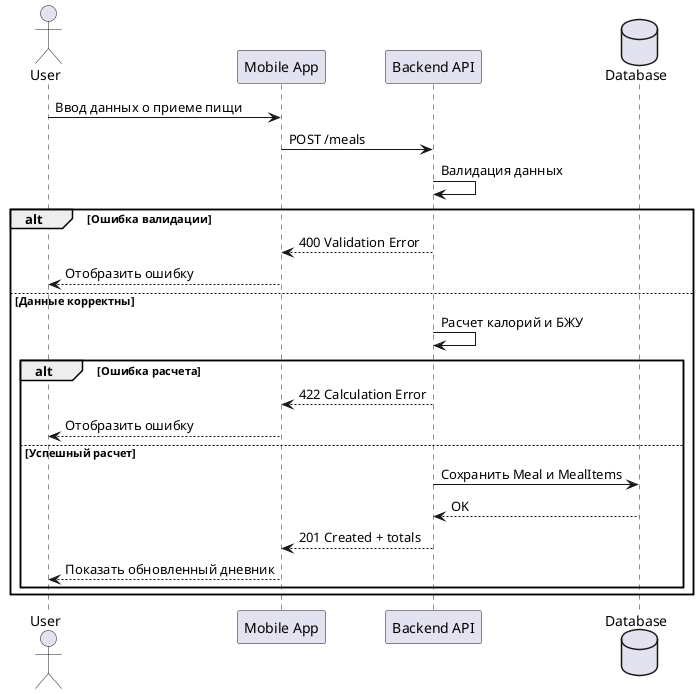

# Функциональные сценарии

## Список use cases MVP

- UC-01 Регистрация пользователя
- UC-02 Авторизация пользователя
- UC-03 Добавление записи в дневник питания
- UC-04 Просмотр аналитики питания
- UC-05 Ввод массы тела
- UC-06 Создание пользовательского блюда
- UC-07 Просмотр и выбор программы питания
- UC-08 Восстановление пароля

## Самый важный сценарий MVP

Критический для MVP сценарий - UC-03, добавление записи в дневник питания:

1. Пользователь открывает дневник
2. Выбирает дату и тип приема пищи
3. Ищет продукт или создает пользовательское блюдо
4. Указывает количество
5. Система рассчитывает КБЖУ
6. Пользователь сохраняет запись
7. Система обновляет дневной баланс

## Диаграмма use case

## Sequence diagram для добавления приема пищи

## Альтернативные потоки

- продукт не найден в базе, поэтому пользователь создает собственный
- количество некорректно, поэтому система запрашивает повторный ввод
- запись уже существует и пользователь ее редактирует
- пользователь удаляет запись, а система пересчитывает дневные итоги
