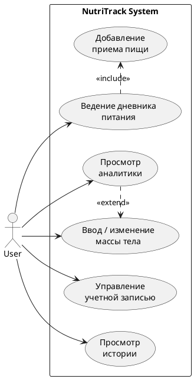
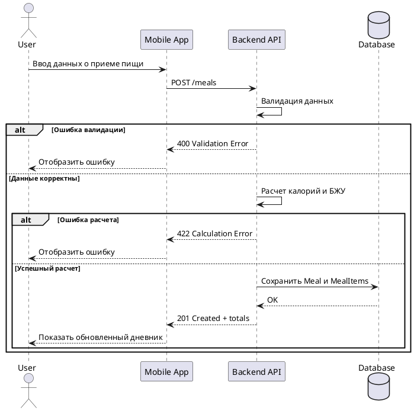

# Функциональные сценарии

## Список use cases MVP

- UC-01 Регистрация пользователя
- UC-02 Авторизация пользователя
- UC-03 Добавление записи в дневник питания
- UC-04 Просмотр аналитики питания
- UC-05 Ввод массы тела
- UC-06 Создание пользовательского блюда
- UC-07 Просмотр и выбор программы питания
- UC-08 Восстановление пароля

## Самый важный сценарий MVP

Критический для MVP сценарий - UC-03, добавление записи в дневник питания:

1. Пользователь открывает дневник
2. Выбирает дату и тип приема пищи
3. Ищет продукт или создает пользовательское блюдо
4. Указывает количество
5. Система рассчитывает КБЖУ
6. Пользователь сохраняет запись
7. Система обновляет дневной баланс

## Диаграмма use case

```plantuml Use Case Diagram
@startuml
left to right direction
actor User

rectangle "NutriTrack System" {
  usecase "Управление\nучетной записью" as UC1
  usecase "Ведение дневника\nпитания" as UC2
  usecase "Добавление\nприема пищи" as UC3
  usecase "Просмотр\nаналитики" as UC4
  usecase "Ввод / изменение\nмассы тела" as UC5
  usecase "Просмотр\nистории" as UC6
}

User --> UC1
User --> UC2
User --> UC4
User --> UC5
User --> UC6
UC2 .> UC3 : <<include>>
UC4 .> UC5 : <<extend>>
@enduml
```

## Sequence diagram для добавления приема пищи

```plantuml Meal Creation Sequence
@startuml
actor User
participant "Mobile App" as App
participant "Backend API" as Api
database "Database" as Db

User -> App: Ввод данных о приеме пищи
App -> Api: POST /meals
Api -> Api: Валидация данных

alt Ошибка валидации
  Api --> App: 400 Validation Error
  App --> User: Отобразить ошибку
else Данные корректны
  Api -> Api: Расчет калорий и БЖУ
  alt Ошибка расчета
    Api --> App: 422 Calculation Error
    App --> User: Отобразить ошибку
  else Успешный расчет
    Api -> Db: Сохранить Meal и MealItems
    Db --> Api: OK
    Api --> App: 201 Created + totals
    App --> User: Показать обновленный дневник
  end
end
@enduml
```

## Альтернативные потоки

- продукт не найден в базе, поэтому пользователь создает собственный
- количество некорректно, поэтому система запрашивает повторный ввод
- запись уже существует и пользователь ее редактирует
- пользователь удаляет запись, а система пересчитывает дневные итоги

# BPMN и decision table

## Основной процесс

Текущий BPMN-артефакт описывает поток добавления нового приема пищи:

1. Пользователь выбирает добавление записи
2. Система выполняет поиск продукта или пользователь создает собственное блюдо
3. Пользователь указывает количество
4. Сервис валидирует калорийность
5. Пользователь получает статус `OK`, `Warning` или `Recommendation`
6. После подтверждения запись сохраняется
7. Система пересчитывает дневной баланс и обновляет экран дневника

## Правила проверки калорийности

| Калории в текущем приеме | Суммарные калории | Цель пользователя | Результат | Уровень | Интерпретация |
| --- | --- | --- | --- | --- | --- |
| - | `> dailyGoal * 1.2` | - | Warning | High | Суточная норма значительно превышена |
| - | `> dailyGoal and <= dailyGoal * 1.2` | - | Warning | Medium | Есть превышение суточной нормы |
| - | `>= dailyGoal * 0.9 and <= dailyGoal` | - | Recommendation | Low | Пользователь близок к лимиту |
| - | `>= dailyGoal * 0.8 and < dailyGoal * 0.9` | - | Recommendation | Medium | Стоит уменьшить порцию |
| - | `< dailyGoal * 0.8` | - | OK | None | Все в порядке |

## Рабочие ссылки

- [BPMN-доска в Unidraw](https://unidraw.io/app/board/9c6772cb272a056ad8a8?allow_guest=true)
